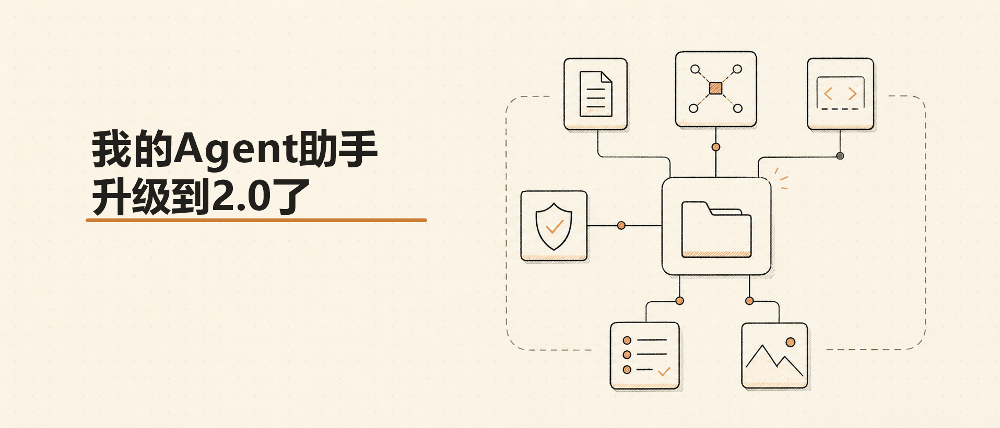

# Agent Engineer Assistant



一个面向 Agent 工程师、产品负责人和架构负责人的生产级 Agent 设计与评审 skill。它的目标不是只给 prompt 建议，而是帮助团队把 Agent 做成可运行、可审计、可维护、可上线的系统。

本 skill 覆盖 Agent 架构规划、工具/MCP 设计、代码 Review、安全评审、上下文与记忆设计、上线验收和团队认知辅导。知识库以 Claude Certified Architect 风格的五大基础 Domain 为底座，并补充 Hermes Agent 与 Odysseus 的源码调研结论。引用源码调研结论时，请标注“截至 2026-07-03”。

每个核心 reference 都包含短小的 `代码示例`：以 Python 最小模式为主，配置类主题使用 YAML/JSON/Bash。示例用于说明工程形状和审查边界，不新增真实运行时代码，也不绑定具体 SDK。

## 适合谁

- 正在用 Codex、Claude Code、OpenAI Agents SDK、LangGraph、MCP、Hermes 等构建 Agent 应用的工程师
- 需要为 Agent 产品做架构拆解、风险控制和上线验收的产品负责人
- 需要统一团队 Agent 工程规范、Review 标准和安全边界的架构师
- 正在评审工具权限、MCP 接入、memory/context 方案或多 Agent 编排设计的技术负责人

## 能力概览

| 场景 | 这个 skill 会帮助你做什么 | 典型输出 |
| --- | --- | --- |
| 架构规划 | 把一个 Agent 想法拆成角色、工具、权限、context、memory、安全和测试方案 | 架构选型、Agent 分工、工具边界、风险点、验收标准 |
| 代码 Review | 按生产级 Agent checklist 检查 loop、tool use、MCP、权限、安全和可靠性 | 分级问题清单、影响说明、可执行修改建议 |
| 安全评审 | 检查 prompt injection、不可信输入、secret、路径、admin 工具和第三方 MCP 风险 | 威胁模型、拦截点、权限策略、上线前必改项 |
| 认知辅导 | 用产品和工程都能理解的语言解释 Agent 编排、MCP、memory、tool policy、脚手架与组件 | 一句话结论、业务类比、工程映射、常见误区 |
| 上线验收 | 检查测试、日志、审计、观测、回滚、文档和运维交接是否齐备 | 发布前 checklist、缺口清单、优先级建议 |

## 快速使用

### 1. 做 Agent 架构规划

把业务目标直接描述给助手：

> 我想做一个能处理客户退款、查订单、发邮件的客服 Agent。请帮我规划架构，并说明哪些地方必须有权限控制和人工确认。

skill 会优先澄清目标和边界，然后给出：

1. 架构选型：单 Agent、多 Agent、固定链路、动态分解或 human-in-the-loop
2. Agent 角色：每个 Agent 的职责、输入、输出、可见上下文和失败上报方式
3. 工具边界：工具数量、schema、读写权限、MCP 接入和超时策略
4. 权限模型：用户角色、admin/non-admin、审批点和不可逆操作拦截
5. Context/Memory：短期上下文、长期记忆、Case Facts、检索、压缩和信息溯源
6. 安全策略：不可信输入包装、prompt injection 防护、secret、路径和第三方 MCP 风险
7. 测试与上线：工具模拟、集成测试、回归测试、观测指标、日志和回滚方案

### 2. 做 Agent 代码 Review

把代码、工具定义、MCP server 设计或架构图交给助手：

> 帮我 review 这段 Agent 代码，重点看有没有生产级风险和 anti-pattern。

Review 会优先列出关键问题，并按严重程度说明影响和修复建议。重点检查：

- agentic loop 是否依赖结构化停止信号，而不是解析自然语言
- 工具结果是否正确回填到消息历史，失败是否结构化返回
- 单个 Agent 工具数量是否失控，工具 schema、超时、截断和重试策略是否合理
- 关键业务规则是否由 hook、policy、权限、schema 或服务端校验强制执行
- 不可信内容是否被隔离包装，而不是直接拼进 system prompt
- Plan Mode、只读模式、admin 工具、文件写入和 MCP 调用是否有真实策略约束
- memory/context 是否有 provenance、压缩边界、冲突处理和人工复核机制
- 上线前是否有测试、日志、审计、观测和回滚方案

### 3. 做安全评审

适合在接入真实业务权限、用户数据、文件系统或第三方 MCP server 前使用：

> 请按生产级 Agent 安全标准，评审我的 MCP 工具设计、文件权限和 memory 方案。

skill 会从不可信输入、prompt injection、secret、文件路径、权限升级、admin 工具、Plan Mode 写权限、第三方 MCP server 等方向检查风险，并给出可落地的拦截策略。

### 4. 做团队认知辅导

适合产品经理、团队负责人或跨职能评审：

> Agent 构建里有哪些脚手架和组件？什么时候该加，什么时候不该加？

skill 会先用业务风险解释问题，再映射到工程机制，避免只堆框架名。

## 知识库结构

| 文件 | 主题 |
| --- | --- |
| `SKILL.md` | skill 入口、工作模式、输出要求和强制规范 |
| `references/agent-scaffolding-components.md` | Agent 脚手架与组件全景索引 |
| `references/agent-scaffolding-patterns.md` | Agent 脚手架设计范式与框架选型 |
| `references/anti-patterns.md` | 常见 Agent 工程反模式 |
| `references/acceptance-test-checklist.md` | skill 验收与回归测试清单 |
| `references/d1-agentic-architecture.md` | Agent 架构与编排 |
| `references/d2-tool-design-mcp.md` | 工具设计与 MCP 集成 |
| `references/d3-claude-code-config.md` | Claude Code 配置与工作流 |
| `references/d4-prompt-engineering.md` | Prompt 工程与结构化输出 |
| `references/d5-context-management.md` | Context 管理与可靠性 |
| `references/d6-hermes-agent-patterns.md` | Hermes Agent 工程模式 |
| `references/d7-odysseus-product-patterns.md` | Odysseus 产品化模式 |
| `references/d8-agent-security-threat-model.md` | Agent 安全威胁模型 |
| `references/d9-agent-productization-checklist.md` | Agent 产品化上线清单 |
| `references/source-research-hermes-odysseus-2026-07-03.md` | Hermes Agent 与 Odysseus 调研来源记录 |

说明：`source-research-hermes-odysseus-2026-07-03.md` 只保留调研来源，不放教学代码；实现模式放在 D1-D9 和索引文档中。

## 设计原则

- **先定边界，再谈能力**：明确 Agent 要解决什么、不解决什么，以及哪些动作必须人工确认。
- **关键规则下沉到确定性机制**：金额限制、权限校验、删除、发送、外部写入等不能只靠 prompt。
- **工具少而清楚**：单个 Agent 的工具应保持克制；工具过多时优先拆分职责。
- **错误必须可解释**：empty result 和 access failure 必须区分，工具失败不能静默吞掉。
- **不可信输入默认隔离**：网页、邮件、文档、记忆、skill 文本、工具输出都不能直接当指令执行。
- **上线必须可追责**：测试、日志、审计、观测、回滚和运维交接是生产级 Agent 的最低要求。

## 项目结构

```text
agent-engineer-assistant/
├── assets/
│   └── cover.png
├── references/
│   ├── acceptance-test-checklist.md
│   ├── agent-scaffolding-components.md
│   ├── agent-scaffolding-patterns.md
│   ├── anti-patterns.md
│   ├── d1-agentic-architecture.md
│   ├── d2-tool-design-mcp.md
│   ├── d3-claude-code-config.md
│   ├── d4-prompt-engineering.md
│   ├── d5-context-management.md
│   ├── d6-hermes-agent-patterns.md
│   ├── d7-odysseus-product-patterns.md
│   ├── d8-agent-security-threat-model.md
│   ├── d9-agent-productization-checklist.md
│   └── source-research-hermes-odysseus-2026-07-03.md
├── README.md
└── SKILL.md
```

## 调研来源

- Hermes Agent：`NousResearch/hermes-agent`，`main` 分支，调研时最新提交 `89acc196067c`，提交时间 2026-07-03。
- Odysseus：`pewdiepie-archdaemon/odysseus`，`dev` 分支，调研时最新提交 `8c943226f815`，提交时间 2026-07-02。
- 详细来源记录见 `references/source-research-hermes-odysseus-2026-07-03.md`。
